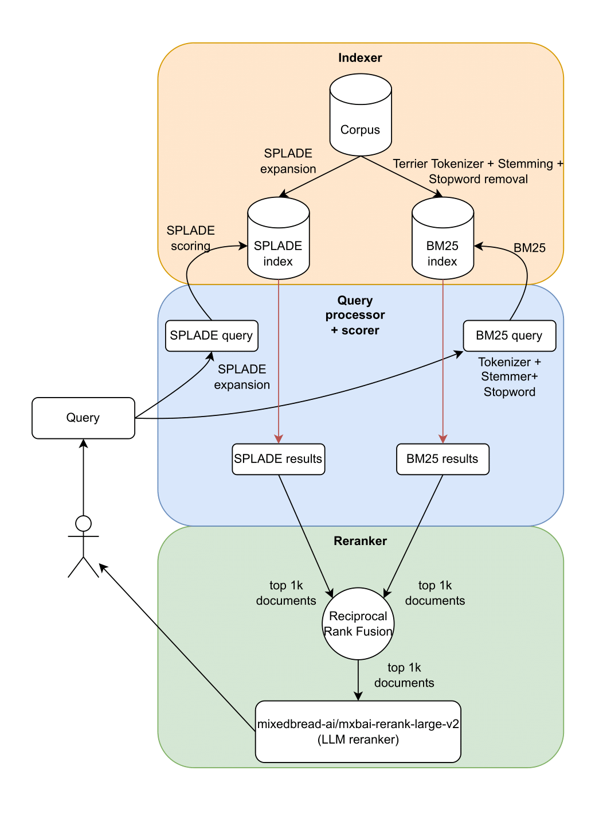

# Search Engine

This repository contains a large majority of the code used for the 2025/1 Research Challenge presented in the Information Retrieval class. The main objective of the challenge was to assess the student's skills as a search engineer by building a search pipeline to efficiently find named pre-indexed Wikipedia entities from user queries, which tended to be both noisy and ambiguous. The chosen evaluation metric for the competition was `nDCG@100`, which evaluates not only the top 100 pages retrieved, but also their ranking (the order in which they are presented). For more details, [check out the competition's page on Kaggle](https://www.kaggle.com/competitions/ir-20251-rc).

Our team managed to secure first place in the challenge, engineering several pipelines, taking advantage of classical methods, such as BM25 and Reciprocal Rank Fusion, along with neural state-of-the-art techniques, such as MonoT5, SPLADE and LLM rerankers.

For our best submission, we aimed to use neural techniques that tended to generalize well (using results primarily from the [BEIR benchmark](https://github.com/beir-cellar/beir)) and blend them with well studied classical techniques. By doing so, we established a very robust first-retrieval, which was then combined with a LLM reranker, which was specifically trained for reranking using reinforcement learning.

The picture below shows our final pipeline. For more specific details, [check out the report](./report.pdf) (in Brazillian Portuguese), containing the specific techniques used for our top 5 best submissions.

## Usage

All of this project's pipelines were written with the [Terrier python library](https://github.com/terrier-org/pyterrier). Some initial submissions we did can be found in the ['classical' directory](./classical/).

A big part of later submissions were implemented in Kaggle, due to the lack of access to local GPUs. You can check out the code/links for the top 5 submissions in the ['submissions' directory of this repository](./submissions/), each containing a relevant README.